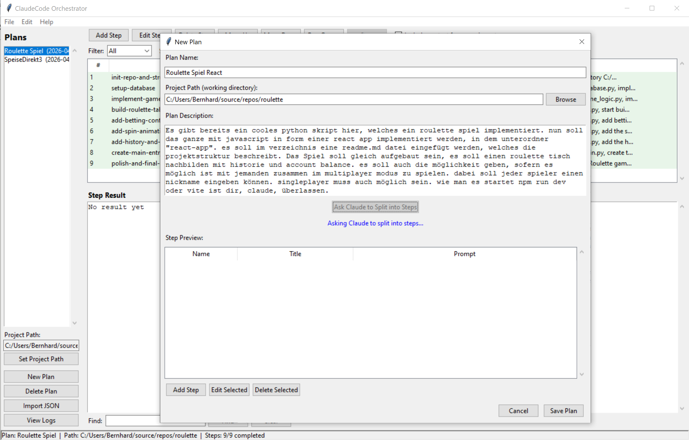

# ClaudeCode Orchestrator

A Python application that orchestrates multi-step Claude Code agent executions with plan management, step queuing, and live output.

The orchestrator (`src/orchestrator/`) provides a tkinter GUI for creating plans, managing step queues, and executing Claude Code agents with context sharing between steps.



### Requirements

- Python 3.10+
- No external dependencies (stdlib only; `tkinterdnd2` optional for drag-and-drop)

### Running

```bash
# Launch the GUI
run.cmd
# or directly:
python -m src.orchestrator.main
```

### Running Tests

```bash
run-tests.cmd
# or directly:
python -m unittest discover -s tests -v
```

### Concurrent Plan Execution

Multiple plans can run their step queues simultaneously. Each plan maintains its own independent execution context.

- **Start multiple plans**: Select a plan and click "Run Queue" (or right-click a step and choose "Run This Step Only"), then switch to another plan and start its queue as well. Each plan runs in its own background thread.
- **Running indicators**: Plans that are currently executing show a `[RUNNING]` label in the plan list. The status bar displays how many plans are running in total.
- **Scoped UI**: The step list, step result viewer, and Run/Stop buttons always reflect the currently selected plan. Switching between plans shows each plan's own steps, output, and execution state.
- **Output buffering**: Each running plan buffers its output independently. When you switch to a plan that is executing, you see its accumulated output so far; live output continues to stream in.
- **Per-plan stop**: The Stop button cancels only the selected plan's execution. Other plans continue running unaffected.
- **Safety**: A running plan cannot be deleted or started a second time.

### Project Structure

```
src/orchestrator/
  main.py              # Main tkinter application
  models.py            # Plan, PlanStep, AgentRun dataclasses
  database.py          # SQLite CRUD layer
  config.py            # Configuration management
  services/
    orchestrator.py    # Step execution engine
    claude_runner.py   # Claude CLI subprocess wrapper
    context_builder.py # Context injection from prior steps
  ui/
    new_plan_dialog.py       # Plan creation with Claude splitting
    step_editor_dialog.py    # Step editing dialog
    settings_dialog.py       # Settings dialog
    import_preview_dialog.py # Import preview with drag-and-drop
    log_viewer.py            # Execution log viewer
```
